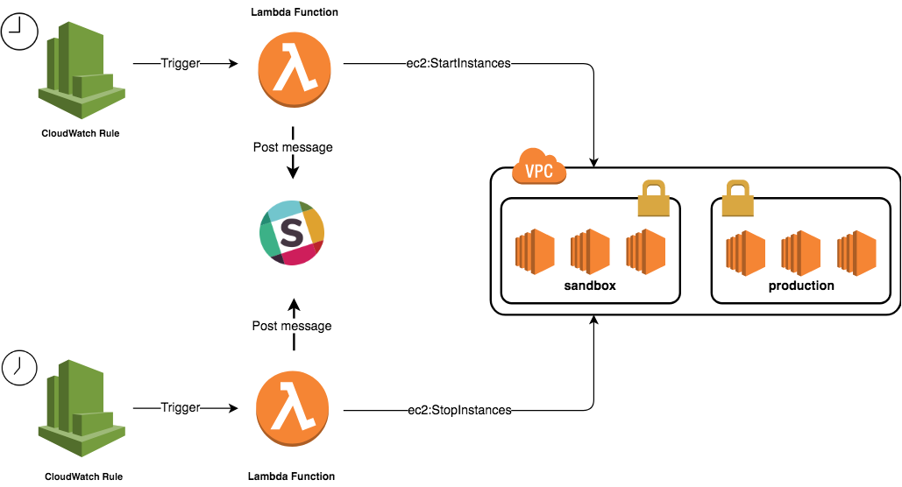

Stop/Start EC2 instances outside business hours to help cutting infrastructure cost based on AWS Lambda

  

# Usage

* [Infrastructure Cost Optimization with Lambda](http://www.blog.labouardy.com/infrastructure-cost-optimization-lambda/)

# Maintainers

* Mohamed Labouardy

# License

* MIT
